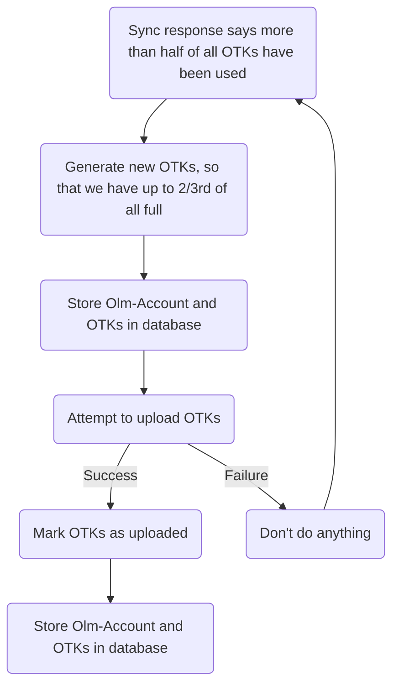
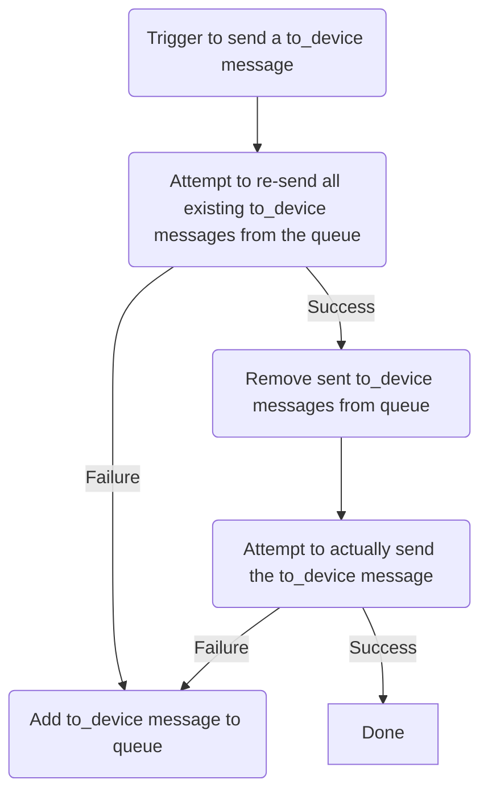

# End-to-end encryption

End-to-end encryption is rather complicated. Beyond the
[bare-bones implementation](https://matrix.org/docs/guides/end-to-end-encryption-implementation-guide)
and [advanced e2ee features](https://matrix.org/docs/guides/implementing-more-advanced-e-2-ee-features-such-as-cross-signing)
a lot of miscellaneous small tricks have been added to make the e2ee experience smoother. This file
acts as a list of said tricks, in no particular order.

## Rotate of megolm sessions
Megolm sessions are rotated (cleared) after encrypting 100 messages or one week, whatever happens
earlier. Additionally, megolm sessions are rotated if a device leaves the room. If a new device joins
the room the megolm session is re-used and it is sent at a later index to that device.

## Requesting known SSSS secrets
Upon new login you can either self-verify and cache SSSS secrets with your recovery passphrase / recovery
key to get the cross-signing and megolm backup keys, or you can self-verify via emoji and afterwards
requests from other devices, after successful self-verification.

For SSSS secrets we want to cache (self-signing key, user-signing key, megolm backup key) we automatically
request those secrets from other devices after successful self-verification, if we weren't verified
before and we don't have them cached.

Additionally, if we still don't have the secrets cached, we try to intelligently guess if other of
our own verified devices are online, max. once per 15 min. This is triggered on receiving `to_device`
events from ourself and getting messages down `/sync` from ourself that weren't sent by us.

## Starting megolm sessions while typing
In order to speed up sending of messages in e2ee rooms, megolm sessions are already created and sent
while a user is typing in the room. While this in theory can result in a megolm session being used to
encrypt zero messages (a device of the room is being removed between typing and sending), in most cases
this will increase sending performance.

## Auto-reply to foreign key requests
When sending a megolm session we record to which device at which index we send the megolm session. On
key requests from other users, we automatically forward the megolm session at the index noted, as in
theory they should have that key anyways. This helps to improve recovery from unable to decrypts.

## Chunked priority sending of megolm keys
In the background we record the last activity time of all devices. This is determined on when we
received the last encrypted `to_device` message of that device. (It could be optimized by also including
encrypted room events). Now, when creating a megolm session, we sort the device list, and chunk it into
chunks of 20. We wait for the first chunk to send, and send the remaining chunks in the background.
This way we make sure that the devices active right now get the key for sure right away, and then,
prioritized by activity, the next devices get the keys seemlessly in the background.

As we implemented auto-reply to foreign key requests other devices can already request the key before
it got received, also ensuring high-availability in case of a badly sorted list.

## OTK (One-Time Key) upload and failure
Because libolm can only hold up to 100 OTKs at all times, we must not upload 100 OTKs. If we were to
do that then another person might claim an OTK and, before they send you a `to_device` message, you'd
upload a new OTK to fill up the 100 OTKs again, forgetting the OTK the other person used. So, we try
to keep the OTKs uploaded at roughly 2/3, so 66 keys.

Additionally, we must make sure that we do not lose any OTKs uploaded, even if the upload request
failed. So we store the olm account, and thus the OTKs, both before and after requesting. We only
mark the OTKs as uploaded after the request was successful.

If now the upload fails, we already stored the non-uploaded OTKs. Thus, next time when attempting to
upload, we take the non-uploaded OTKs into account for how many to create, and then re-try the
uploading.

## Auto-recreate corrupted olm sessions
If we receive an encrypted `to_device` message that we can't decrypt, that means the olm session with
the remote device got corrupted. So, we create a new olm session and send an encrypted `m.dummy` via
`to_device` messaging to signal the new olm session.

## Replay of sent `to_device` messages
As olm is a double-ratchet the ratchet on the receiving and the sending client must be the same. So,
a lost `to_device` event could be fatal to the olm session. Thus, we record all sent `to_device` messages
that failed to send. Before sending the next `to_device` message (and periodically after `/sync`) we
empty that queue, to make sure that the `to_device` messages are sent, and thus the olm ratchets stay
in sync.

Additionally, when sending an encrypted `to_device` event to a device, we remember that content, one
message per recipient device. Now, if we receive an encrypted `m.dummy`, this usually indicates that
the remote device started a new olm session, likely due to corruption. So, we re-send the saved
content, as it might e.g. contain a megolm key needed to decrypt messages.
