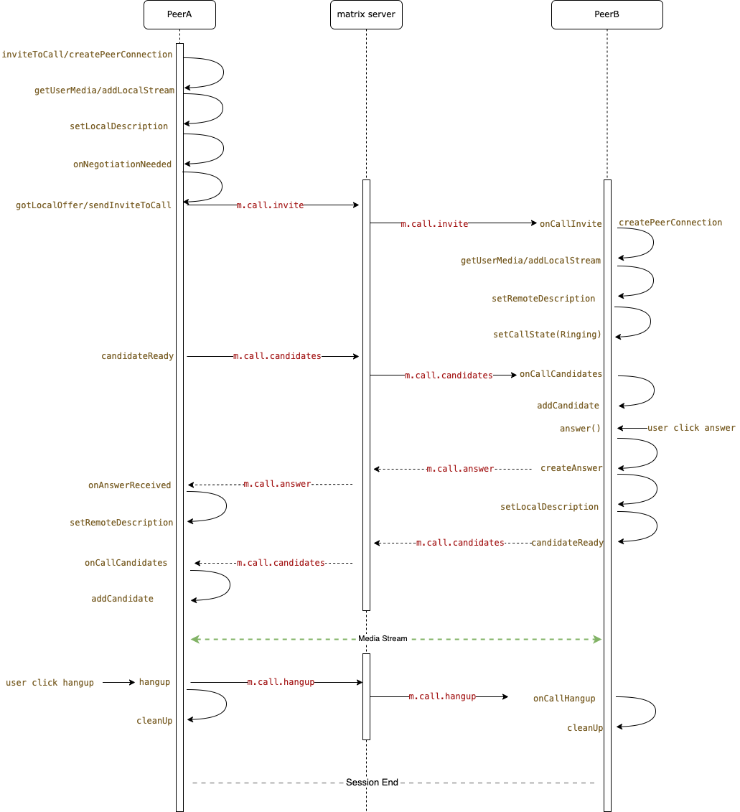

# Famedly Calls

Supports
- 1:1 webrtc calls
- Group calls with:
  - Mesh webrtc calls
  - just handling state of calls and signallnig for e2ee keys in sfu mode f.ex (Livekit calls)

Places where we diverted from spec afaik:
- To enable p2p calls between devices of the same user, pass a `invitee_device_id` to the `m.call.invite` method
- **to-device call events such as in msc3401 MUST have a `room_id` to map the event to a room**

## Overview

`VoIP` is a module that provides a simple API for making 1:1 and group calls.

`CallSession` objects are created by calling `inviteToCall` and `onCallInvite`.

`GroupCallSession` objects are created by calling `fetchOrCreateGroupCall`.

## Group Calls

All communication for group calls happens over to-device events except the `com.famedly.call.member` event.

Sends the `com.famedly.call.member` event to signal an active membership. The format has to be the following:

### Events -

```json5
"content": {
    "memberships": [
        {
            "application": "m.call",
            "backend": {
                "type": "mesh"
            },
            "call_id": "",
            "device_id": "YVGPEWNLDD",
            "expires_ts": 1705152401042,
            "scope": "m.room",
            "membershipID": "gor1Gt5BCIlyrxjyHnaEJQ==",
        }
    ]
}
```

- **application**: could be anything f.ex `m.call`, `m.game` or `m.board`
- **backend**: see below
- **call_id**: the call id, currently setting it to the roomId makes the call for the whole room, this is to avoid parallel calls starting up. For user scoped calls in a room you could set this to `AuserId:BuserId`. The sdk does not restrict setting roomId for user scoped calls atm.
- **device_id**: The sdk supports calling between devices of same users, so this needs to be set to the sender device id.
- **expires_ts**: ms since epoch when this membership event should be considered expired. Check `lib/src/voip/utils/constants.dart` for current values of how long the inital period is and how often this gets autoupdated.
- **scope**: room scoped calls are `m.room`, user scoped can be `m.user`.
- **membershipID**: used by mesh group calls to terminate stale calls. to-device events where sender_session_id do not match the membershipID from the state event should be ignored. Similarly existing calls with a mismatched session id should be terminated.


#### The backend can be either `mesh` or `livekit`

##### Livekit - 
```json5
"backend": {
    "livekit_alias": "!qoQQTYnzXOHSdEgqQp:im.staging.famedly.de",
    "livekit_service_url": "https://famedly-livekit-server.teedee.dev/jwt",
    "type": "livekit"
},
```

##### Mesh -
```json5
"backend": {
    "type": "mesh"
},
```

#### E2EE Events -

When in SFU/Livekit mode, the sdk can handle sending and requesting encryption keys. Currently it uses the following events: 

- sending: `com.famedly.call.encryption_keys`
- requesting: `com.famedly.call.encryption_keys.request`

You need to implement `EncryptionKeyProvider` and set the override the methods to interact with your actual keyProvider. The main one as of now is `onSetEncryptionKey`.

You can request missing keys whenever needed using `groupCall.requestEncrytionKey(remoteParticipants)`.

## 1:1 calls

### 1. Basic call flow

This flow explains the code flow for a 1v1 call.

This code flow is still used in group call, the only difference is that group call uses `toDevice` message to send `m.call.*` events



### 2.Implement the event handlers

The code here is to adapt to the difference between `flutter app` and `dart web app` and prevent importing `flutter` dependencies in `dart` app.

We need to import `dart_webrtc` or `flutter_webrtc`, and map the platform-specific API `(mediaDevices, createPeerConnection, createRenderer)`
implementations to the corresponding packages.

In addition, we can respond to the call to start and end in this delegate, start or turn off the incoming call ringing

``` dart
// for dart app
import 'package:dart_webrtc/dart_webrtc.dart' as webrtc_impl;
// for flutter app
// import 'package:flutter_webrtc/flutter_webrtc.dart' as webrtc_impl;

class MyVoipApp implements WebRTCDelegate {
  @override
  MediaDevices get mediaDevices => webrtc_impl.navigator.mediaDevices;
  @override
  Future<RTCPeerConnection> createPeerConnection(
      Map<String, dynamic> configuration,
      [Map<String, dynamic> constraints = const {}]) =>
      webrtc_impl.createPeerConnection(configuration, constraints);
  @override
  VideoRenderer createRenderer() => RTCVideoRenderer();

  @override
  Future<void> playRingtone() async {
      // play ringtone
  }
  Future<void> stopRingtone() async {
      // stop ringtone
  }

  Future<void> registerListeners(CallSession session) async {
    // register all listeners here
    session.onCallStreamsChanged.stream.listen((CallStateChange event) async {});
    session.onCallReplaced.stream.listen((CallStateChange event) async {});
    session.onCallHangupNotifierForGroupCalls.stream.listen((CallStateChange event) async {});
    session.onCallStateChanged.stream.listen((CallStateChange event) async {});
    session.onCallEventChanged.stream.listen((CallStateChange event) async {});
    session.onStreamAdd.stream.listen((CallStateChange event) async {});
    session.onStreamRemoved.stream.listen((CallStateChange event) async {});
  }

  Future<void> handleNewCall(CallSession session) async {
    // handle new call incoming or outgoing
    switch(session.direction) {
        case CallDirection.kIncoming:
            // show incoming call window
            break;
        case CallDirection.kOutgoing:
            // show outgoing call window
            break;
    }
  }

  Future<void> handleCallEnded(CallSession session) async {
    // handle call ended by local or remote
  }
}
```

### 3.Start a outgoing call

When the delegate is set we can initiate a new outgoing call.
We need to use the matrix roomId to initiate the call, the initial call can be 
`CallType.kVoice` or `CallType.kVideo`.

After the call is sent, you can use `onCallStateChanged` to listen the call state events. These events are used to change the display of the call UI state, for example, change the control buttons, display `Hangup (cancel)` button before connecting, and display `mute mic, mute cam, hold/unhold, hangup` buttons after connected.

You cannot call a whole room, please specify the userId you intend to call in `inviteToCall`


```dart
final voip = VoIP(client, MyVoipApp());

/// Create a new call
final newCall = await voip.inviteToCall(roomId, CallType.kVideo, userId);

newCall.onCallStateChanged.stream.listen((state) {
  /// handle call state change event，
  /// You can change UI state here, such as Ringing,
  /// Connecting, Connected, Disconnected, etc.
});

/// Then you can pop up the incoming call window at MyVoipApp.handleNewCall.
class MyVoipApp implements WebRTCDelegate {
...
  Future<void> handleNewCall(CallSession session) async {
      switch(session.direction) {
          case CallDirection.kOutgoing:
              // show outgoing call window
              break;
      }
  }
...

/// end the call by local
newCall.hangup();
```

### 4.Answer a incoming call

When a new incoming call comes in, registerListeners will be called right before handleNewCall is called, and the answering interface can pop up at this time, and use `onCallStateChanged` to listen to the call state.

The incoming call window need display `answer` and `reject` buttons, by calling `newCall.answer();` or `newCall.reject();` to decide whether to connect the call.

```dart
...
  Future<void> registerListeners(CallSession newCall) async {
      switch(newCall.direction) {
          case CallDirection.kIncoming:
              /// show incoming call window
              newCall.onCallStateChanged.stream.listen((state) {
                /// handle call state change event
              });
              break;
      }
  }
...

/// Answer the call
newCall.answer();
// or reject the call
newCall.reject();
```

To reject a call locally but not send a event, use `newCall.reject(shouldEmit: false)`

### 5.Render media stream

The basic process of rendering a video stream is as follow code.

```dart
class RemoteVideoView extends Widget {
VideoElement get videoElement => renderer.element;

RTCVideoRenderer get renderer => remoteStream.renderer as RTCVideoRenderer;

final WrappedMediaStream remoteStream;

RemoteVideoView(this.remoteStream){
    renderer.srcObject = remoteStream.mediaStream;
}
...
 @override
  Element build() {
    return divElement(
        children: [
            ...
            videoElement,
            ...
        ]);
}
...

}
```

Usually there are four media streams in a 1v1 call, which are

* `localUserMediaStream`
* `localScreenSharingStream`
* `remoteUserMediaStream`
* `remoteScreenSharingStream`

They can be get by the methods of `CallSession`. the `newCall.onCallStreamsChanged` event is fired when these streams are added or removed.
When the media stream changes, we can change the UI display according to the priority.
`remoteScreenSharingStream` always needs to be displayed first, followed by `remoteUserMediaStream`

### Glare

Short note on a difference between canHandleNewCall and glare stuff - 
- canHandleNewCall should be set to false only if the client can see a connected call. This prevents any other user's call and fires a handleMissedCall. 
- glare stuff on the other hand tries to handle collision of invites, if both clients get a invite from one another at the same time, one of the invites should be discarded. (Ideally the other one should be answered by default, but for now we just decided to let it ring to avoid unexpected answers.)
